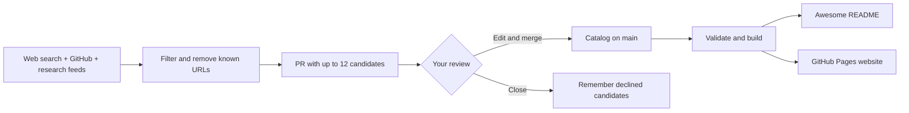

# Your maintainer walkthrough

## What you own

There are three parts: a **resource catalog**, a **publisher** that turns it into an Awesome list and website, and a **discovery workflow** that proposes additions for your review.

A repository is a versioned folder on GitHub. A branch is a proposed alternative version. A pull request (PR) lets you review a branch before merging it into `main`, the accepted version. GitHub Actions runs scripts on GitHub's computers; your Mac and this chat do not have to stay open. GitHub Pages serves the finished website.



## Connect broad web search

The repository and website need no paid service. Broad discovery needs a Brave Search API key:

1. Open [Brave Search API](https://brave.com/search/api/) and create an account or use an existing one.
2. Choose the **Search** API, review current terms, and set a spending limit. This project uses Web Search, not Answers.
3. Create a key in Brave's dashboard.
4. Open [the repository's Actions secrets](https://github.com/joseruiz1571/awesome-agent-security-learning/settings/secrets/actions).
5. Choose **New repository secret**. Name it exactly `BRAVE_SEARCH_API_KEY`, paste the key into the secret field, and save. Never paste it into chat, issues, PRs, or catalog files.
6. Open **Actions → Discover learning resources → Run workflow** on `main`. Leave the partial-test option unchecked.
7. Read the completed workflow summary and any resulting PR. No new candidates means no PR.

Eight web queries return up to ten results each. Two or three scheduled runs per month use 16–24 requests. At Brave's advertised September 28, 2026 rate of $5 per 1,000 requests, that is approximately $0.08–$0.12 before credits, taxes, or additional manual runs. Pricing and credits can change; check the provider. No language-model API is used or billed. The website attributes Brave Search API.

A full run without the secret fails with a clear setup message. An explicitly selected partial test can exercise GitHub and feeds while setup is unfinished; it does not test broad web search.

## Review your first PR without a terminal

1. Open **Pull requests**, then the discovery proposal.
2. Read the checklist and follow each resource link. Verify educational value, relevance, availability, and access terms.
3. Open **Files changed** and inspect `data/resources.json`.
4. To edit, use the file's edit option on the PR branch. Alternatively, switch the repository branch selector to the proposal branch and edit the catalog there.
5. Remove entire JSON objects for rejected items, preserving commas between remaining objects. Checks catch malformed JSON.
6. Replace generic descriptions with useful original summaries. Correct type, topics, scope, cost, and availability. After inspecting a page, change `verification` to `Page inspected` and `checked_on` to a date such as `2026-10-12`.
7. Commit edits to the proposal branch, not main. Review the diff and checks again.
8. **Merge pull request** accepts every remaining addition. Publishing regenerates the README and public page.
9. **Close pull request** without merging declines the whole batch. Candidate IDs prevent repeated proposals.

You can ask Codex: “Review PR #N, inspect its links, remove weak additions, and improve descriptions. Leave it open for me to merge.” This lets you delegate preparation while retaining the decision.

Do not merge generic summaries simply to clear the queue. A useful small library is better than a noisy large one.

## Schedule

GitHub starts the workflow every Monday at **13:23 UTC**. A calendar check uses September 28, 2026 as the anchor and runs discovery on alternate weeks: October 12, October 26, November 9, and so on. It uses elapsed weeks, so month and year changes do not break the cadence. Off-week runs exit after the calendar check. Manual runs bypass the gate.

In Chicago, that time is 8:23 a.m. during daylight saving time and 7:23 a.m. during standard time. Scheduling is best effort: GitHub can delay or drop jobs. Failed runs require manual rerunning rather than an automatic next-day retry. Public-repository schedules can be disabled after 60 days without repository activity; check Actions occasionally and re-enable if needed. [GitHub schedule documentation](https://docs.github.com/en/actions/reference/workflows-and-actions/events-that-trigger-workflows#schedule).

## How discovery decides

- **Brave:** eight targeted queries cover courses, certifications, labs, books, podcasts, YouTube, research, safety, and governance. A past-month freshness filter favors recent material and may miss evergreen resources. Human submissions and initial research fill that gap.
- **GitHub:** four searches for recently updated repositories. No minimum star count excludes small projects.
- **Feeds:** selected research blogs and OWASP. Only exposed feed entries are available, not entire archives.
- **Filtering:** text must contain an AI/agent clue and a security/safety/governance clue. Simple keyword rules have false positives and false negatives.
- **Classification:** keyword rules propose topics and format. You correct them.
- **Deduplication:** URLs are normalized, tracking parameters removed, and matches checked against the catalog, inbox, exclusions, and all previous PR candidate IDs. Different URLs for the same work still need human review.
- **Batch size:** round-robin selection across sources stops at 12 candidates. Leftovers are not permanently queued; they may return while still visible in search/feed results.
- **Failures:** partial failures appear in the summary. All-source failure or failure of all required Brave queries fails the run visibly.

Search content is treated as data. No repository is installed or executed, and no model follows instructions from retrieved content. Candidate pages are not automatically fetched; you inspect them. Search snippets are transient inputs to filtering and classification and are not copied into published descriptions.

## File map

| File | Purpose | When to edit |
| --- | --- | --- |
| `data/resources.json` | Accepted catalog on main; proposed additions on branches | Add or improve entries |
| `data/research-inbox.json` | Original suggestions needing investigation | Finish research |
| `data/ignored.json` | URLs and reasons for exclusion | Block unwanted leads |
| `data/discovery.json` | Queries, feeds, date anchor, batch cap | Tune coverage |
| `scripts/catalog.py` | Validation and URL normalization | Change data rules |
| `scripts/discover.py` | Searches, filtering, deduplication, proposals | Change discovery behavior |
| `scripts/build.py` | Generate README and website | Change output structure |
| `site/index.html` | Page layout | Change presentation |
| `site/style.css` | Visual design and responsive layout | Change styling |
| `site/app.js` | Browser search and filters | Change interaction |
| `.github/workflows/discover.yml` | Schedule and PR creation | Change automation |
| `.github/workflows/publish.yml` | Checks, README update, Pages deployment | Change publishing |
| `.github/workflows/validate.yml` | Contributor PR checks | Change validation |
| `tests/test_catalog.py` | Regression checks | Protect new behavior |

Python uses only its standard library. The website uses plain HTML, CSS, and JavaScript. There is no database, web server application, or frontend framework to maintain. The site exposes a downloadable JSON catalog.

## Understand a resource entry

```json
{
  "id": "example-agent-lab",
  "title": "Example Agent Security Lab",
  "url": "https://example.org/lab",
  "type": "CTFs & labs",
  "topics": ["Security", "Red teaming"],
  "scope": "Agent-specific",
  "cost": "Free / infrastructure costs",
  "description": "Practice evaluating tool permissions in an isolated agent lab.",
  "availability": "Available",
  "checked_on": "2026-10-12",
  "evidence": "https://example.org/lab",
  "verification": "Page inspected"
}
```

This is an illustrative entry, not a real recommendation. `id` must be unique. `scope` is `Agent-specific`, `Broader AI`, or `Foundations`. Topics are Security, Red teaming, Safety, and Governance. A provider page supports the description but is not independent proof of its claims. `checked_on` means page inspection, not an automated search date. Discovery records `discovered_on` separately.

## Work locally

Install Python 3.12 or newer and GitHub CLI, then authenticate GitHub CLI. From the repository folder:

```sh
python3 -m unittest discover -s tests -v
python3 scripts/build.py
python3 -m http.server 8000 --directory _site
```

Open `http://localhost:8000`. Stop the server with Control+C. Generated `_site/` and temporary `work/` files are ignored by Git. Never commit `.env` files.

With your key already in the environment, `python3 scripts/discover.py` performs a dry discovery run and writes `work/candidates.json` and `work/proposal.md`. Adding `--apply` changes the local catalog. The script never pushes or creates PRs; the workflow handles that after validation.

## Permissions and limits

Discovery can write proposal branches and create PRs. Publishing can synchronize README and deploy Pages. Contributor PR checks are read-only and receive no Brave key. Actions are pinned to revisions; Dependabot proposes monthly updates. The bot never merges or approves proposals.

GitHub's setting to allow Actions to create PRs is required. GitHub groups creation and approval capability into one setting; the workflow never uses approval. GitHub may restrict or require approval for checks on token-created PRs, so discovery validates the actual proposed catalog before creating the PR. If checks are absent after human edits, close and reopen the PR yourself, or manually run validation on its branch. [GitHub token behavior](https://docs.github.com/en/actions/concepts/security/github_token).

If you later protect main against direct writes, change the README synchronization step to use a PR or stop committing README; otherwise publishing will fail there. Concurrent pushes can cause a safe push rejection: rerun Publish on the newest main. The workflow never force-pushes.

## Troubleshooting

| Symptom | Check |
| --- | --- |
| Missing API key | Repository secret must be named `BRAVE_SEARCH_API_KEY` |
| Brave failures | Key validity, credits, spending limit, provider status |
| PR creation denied | Settings → Actions → General → allow Actions to create PRs |
| Missing website | Settings → Pages → Source: GitHub Actions; inspect Publish run |
| No new PR | Discovery summary; candidates may be duplicates or filtered out |
| No scheduled runs | Default branch, off-week gate, inactivity disabling |
| Feed failures | Verify or replace feed URL in discovery.json |
| Validation failure | JSON syntax, allowed labels, duplicate URLs |

## Maintenance and rollback

Every two weeks, review proposals. Monthly, revisit the research inbox and a sample of old links. Quarterly, tune queries. This version proposes additions; it does not automatically detect every broken link, changing price, or course quality problem.

Pause with **Actions → Discover learning resources → Disable workflow**. Undo an accepted addition through a catalog PR or GitHub's revert function. Keep catalog data separate from styling.

## Working with Codex on future projects

Describe the outcome, audience, examples, and decisions you want to retain. Ask for a small working version, verification evidence, and a file walkthrough. You do not need to select a framework before beginning.

Useful next requests:

- “Walk me through one resource from search to publication.”
- “Help review this proposal; leave merging to me.”
- “Add a research feed and show how you tested failures.”
- “Improve governance-course coverage without increasing the search budget.”
- “Explain the discovery workflow line by line.”

For future changes, ask for a PR so you can review exactly what changed.
